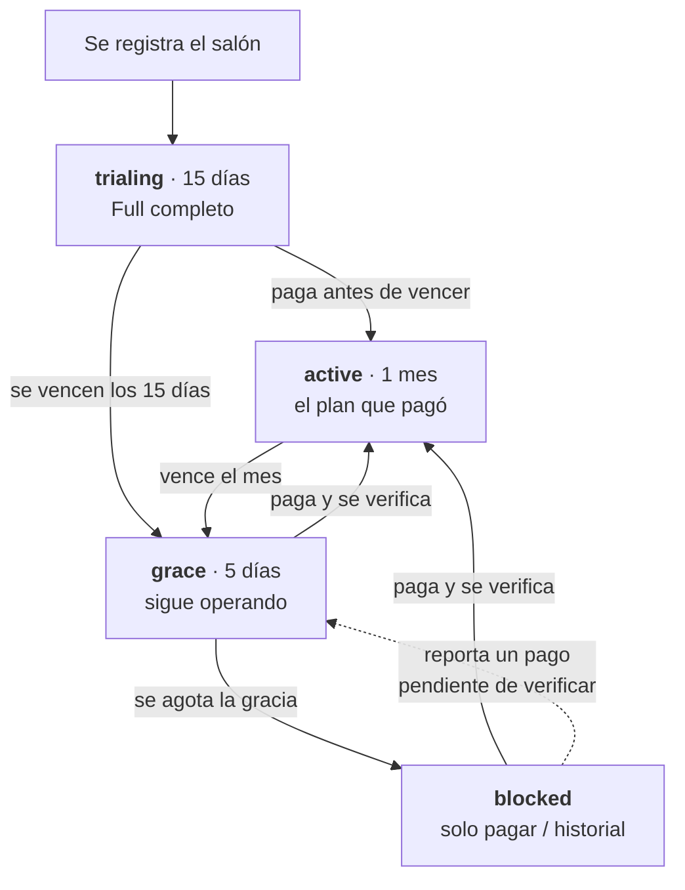

# Control de acceso por suscripción — lo que el front necesita saber

Ticket SUB-5 / CLYP-338. Aquí va **qué puede hacer cada salón**: su plan y su estado de pago.
El cobro (Cobrix, enlaces de pago, reportes) está en [suscripciones-cobrix-frontend.md](./suscripciones-cobrix-frontend.md).

## El flujo, de principio a fin



Paso a paso, con lo que el front muestra en cada tramo:

1. **Se registra** → el backend le abre la prueba solo. No hay que llamar a nada.
2. **Días 1-15 (`trialing`)** → tiene el **Full completo**. Badge con los días que le quedan
   (`accessEndsAt`). Es el escaparate: se le enseña todo lo que puede comprar.
3. **Día 16 (`grace`)** → se acabó la prueba pero **sigue operando 5 días**. Aquí es donde toca
   la pantalla de "elige tu plan" con los dos precios.
4. **Paga** → el acceso se extiende un mes y queda `active` **con el plan que pagó** — si eligió
   Básico, a partir de aquí la IA y la nómina se le muestran bloqueadas con CTA de upgrade.
5. **No paga en 5 días (`blocked`)** → pantalla de bloqueo. Sus datos siguen intactos; solo
   pierde el permiso de operar.
6. **Cada mes** el ciclo se repite desde `active`: vence → gracia → bloqueo.
7. **En cualquier punto**, si reporta un pago que está por verificarse, vuelve a tener acceso
   (`graceCause: "pending_report"`) hasta que se resuelva. Nunca se bloquea a quien está esperando
   la verificación.

Los salones **exentos** (`billingExempt: true`) no entran nunca en este ciclo: siempre `active`
con su plan.

---

## Regla de oro

**Todo sale de `GET /subscription/access`.** El front no deriva permisos del plan, ni de fechas,
ni del `status` guardado: pregunta y pinta. El backend combina los dos ejes (qué plan compró y si
está al día) y responde ya resuelto.

Consúltalo al entrar a la app y después de cualquier pago o cambio de plan.

---

## `GET /subscription/access` (rol `adm`)

```json
{
  "planId": "full",
  "planName": "Full",
  "status": "trialing",
  "canOperate": true,
  "graceCause": null,
  "accessEndsAt": "2026-09-19T18:27:58.000Z",
  "graceEndsAt": null,
  "hasPendingReport": false,
  "billingExempt": false,
  "features": {
    "payroll": true, "analytics": true, "aiSuggestions": true,
    "workerApp": true, "clientApp": true, "prioritySupport": true
  },
  "limits": { "maxWorkers": 20, "workersInUse": 1, "canAddWorker": true }
}
```

| Campo | Qué significa |
|---|---|
| `status` | `trialing` \| `active` \| `grace` \| `blocked` |
| `canOperate` | `false` → la app va a la pantalla de pago. Es el interruptor general |
| `features` | Mapa booleano ya resuelto: si es `true`, se muestra; si es `false`, no |
| `graceCause` | `expired` (venció y no pagó) o `pending_report` (pagó y falta verificar) |
| `accessEndsAt` | Fin de la prueba o del período pagado. Para el contador "te quedan X días" |
| `graceEndsAt` | Fin de la ventana de gracia (5 días), solo en `grace` |
| `hasPendingReport` | Hay un pago esperando verificación: **no insistir con que pague** |
| `billingExempt` | Salón exento de cobro: esconderle pantalla de pago y avisos de vencimiento |
| `limits.canAddWorker` | Ya combina plan + estado: úsalo para habilitar el botón "agregar trabajador" |

### Un `false` en `features` tiene dos lecturas

- `canOperate: true` → **le falta plan**: muestra la función bloqueada con CTA "sube a Full".
- `canOperate: false` → **le falta pagar**: no pongas CTA de upgrade, manda a la pantalla de pago.

---

## Qué pintar en cada estado

| Estado | Acceso | Qué mostrar |
|---|---|---|
| `trialing` | completo | Badge "Prueba — te quedan N días" (`accessEndsAt`). Tiene el **Full completo**: nómina, IA, análisis, app del trabajador y el tope de 20 trabajadores del Full |
| `active` | completo según su plan | Nada especial. Lo que no incluye su plan va bloqueado con CTA de upgrade |
| `grace` | sigue operando | Banner "tu suscripción venció, tienes hasta `graceEndsAt`". Si `graceCause: "pending_report"`, el mensaje es otro: "estamos verificando tu pago", **sin pedirle que pague de nuevo** |
| `blocked` | ninguno | Pantalla de bloqueo: solo historial, instrucciones de pago y reportar pago |

### La prueba

Un salón recién registrado nace con **15 días de Full**, sin pedir tarjeta. Al vencer entra en
**5 días de gracia** conservando el Full, y recién después se bloquea: 20 días en total. Durante
la gracia es cuando toca mostrarle los planes para que elija.

---

## Los tres 403 (no son lo mismo)

Todos traen `reason` en el cuerpo. El front decide por ahí, nunca por el texto del mensaje.

```jsonc
// 1. No puede operar: suscripción vencida → pantalla de pago
{ "reason": "subscription_blocked", "status": "blocked", "accessEndsAt": "..." }

// 2. Su plan no incluye la función → CTA "sube a Full". NO bloquear la app
{ "reason": "plan_upgrade_required", "feature": "payroll", "planId": "basico" }

// 3. Llegó al tope de su plan → CTA de upgrade en ese formulario
{ "reason": "plan_limit_reached", "feature": "maxWorkers", "limit": 2, "current": 2 }
```

---

## Superficies

### Panel del dueño

Las funciones que su plan no incluye se muestran **bloqueadas con CTA de upgrade** — son el
anzuelo, y quien decide pagar las está viendo.

### App del cliente final

Consulta **`GET /subscription/features/company/:companyId`** (público, sin token):

```json
{ "companyId": 36, "aiSuggestions": true, "clientApp": true }
```

Si `aiSuggestions` es `false`, la sugerencia con IA **simplemente no aparece**: sin candado, sin
"disponible pronto". El cliente final no decide el plan del salón y no debe sentir que la app está
incompleta.

---

## `GET /subscription/plans`

Catálogo con precios y límites, más `trialDays` (15) y `graceDays` (5). Úsalo para la pantalla de
"elige tu plan": no hardcodees ni precios ni días.

---

## Notas

- Confía en la respuesta, no en la BD: el `plan_id` guardado puede no coincidir con lo que el
  usuario ve (un salón antiguo sin plan elegido igual recibe el Full durante su prueba).
- El bloqueo se **calcula** con las fechas en cada consulta; el `status` de la tabla es una caché.
  Por eso no hace falta esperar a ningún cron para que un pago se refleje.
- Hoy el backend todavía no corta todos los endpoints de negocio con el guard (falta SUB-12), así
  que el front no debe asumir que un bloqueado recibirá 403 en cualquier acción: la pantalla de
  bloqueo la decide `canOperate`.
