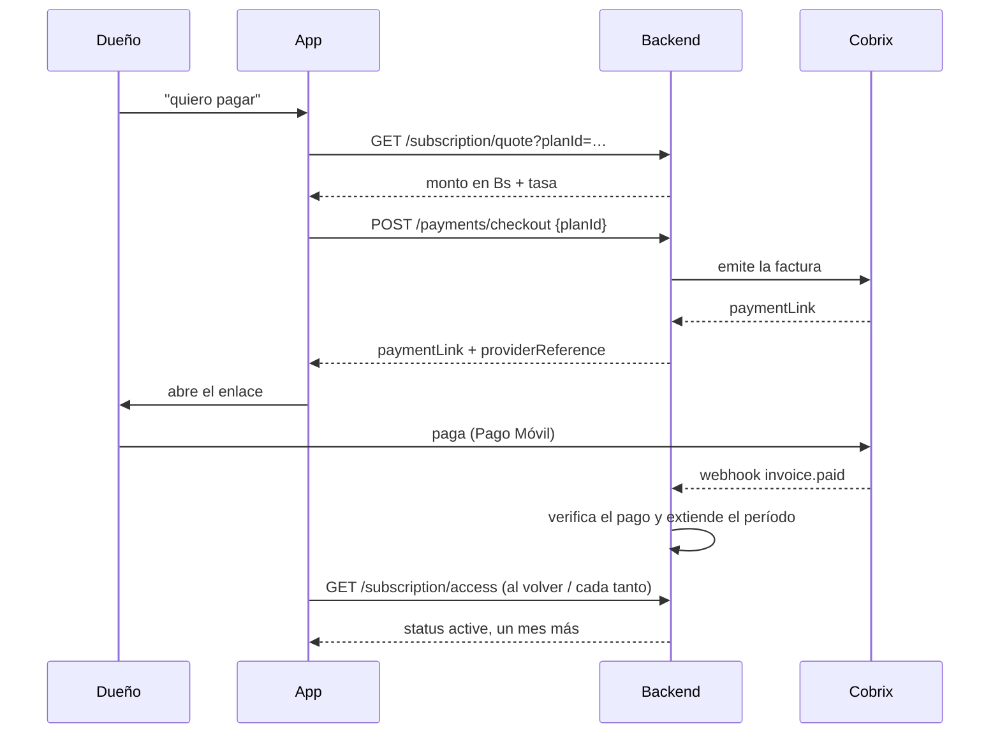

# Cobro de la suscripción (Cobrix) — lo que el front necesita saber

Tickets SUB-2 / SUB-3 / SUB-10. Aquí va **cómo cobra el salón su suscripción**: cotizar, emitir el
cobro, pagar y esperar la conciliación. Los permisos (qué puede hacer según plan y estado) están en
[suscripciones-acceso-frontend.md](./suscripciones-acceso-frontend.md).

## El flujo, en orden

```
GET /subscription/plans            → elige plan
GET /subscription/quote?planId=…   → cuánto es en Bs hoy
POST /subscription/payments/checkout → emite el cobro y devuelve el enlace
   → el dueño paga por el enlace  → Cobrix concilia y verifica solo
   → o paga por fuera             → POST /subscription/payments/report
GET /subscription/access           → confirmar que ya quedó activo
```



**El orden importa:** la factura tiene que existir **antes** de pagar. Cobrix concilia movimientos
bancarios contra documentos abiertos; un pago sin factura emitida no se puede casar solo y termina
en verificación manual.

---

## 1. Cotizar — `GET /subscription/quote?planId=basico|full`

Devuelve el monto exacto en Bs con la tasa del momento. **No escribe nada**, se puede llamar las
veces que haga falta.

```json
{
  "planId": "basico", "planName": "Básico",
  "amountVesMinor": 1192488, "amountVesFormatted": "11.924,88", "currency": "VES",
  "rate": 794.9917, "rateSourceLabel": "…", "quotedAt": "…", "validUntil": "…"
}
```

Muestra `amountVesFormatted`. Guarda `amountVesMinor`, `rate` y `quotedAt`: hacen falta si el pago
se reporta a mano. Pasada `validUntil` hay que recotizar.

Sin `planId` cotiza el plan que tenga guardado — en la pantalla de "elige tu plan" **manda siempre
el `planId` explícito**.

---

## 2. Emitir el cobro — `POST /subscription/payments/checkout`

```json
{ "planId": "full", "identification": "V-12345678" }
```

- `planId` opcional: si no va, usa el plan actual. **Para cambiar de plan, mándalo.**
- `identification` (cédula o RIF) **solo la primera vez**: después el backend reusa la guardada.
  Mándala de nuevo únicamente si el dueño la está corrigiendo.

Respuesta (201):

```json
{
  "invoiceId": 4, "providerReference": "clyps-36-1788548080",
  "paymentLink": "https://…", "planId": "full", "planName": "Full",
  "amountMinor": 2225977, "amountFormatted": "22.259,77", "currency": "VES",
  "expiresAt": "2026-09-05T22:54:41.000Z", "payerIdentification": "V-12345678",
  "reused": false
}
```

- Abre `paymentLink` tal cual, no lo armes a mano.
- `reused: true` = ya había una factura viva y se devolvió esa. **Pulsar dos veces no emite dos
  cobros**, así que no hace falta bloquear el botón por miedo a duplicar.
- Vencida (`expiresAt`), se pide otra: el mismo endpoint emite una nueva.

### Errores que el front debe manejar

| Código | `code` | Qué hacer |
|---|---|---|
| 503 | `COBRIX_NOT_CONFIGURED` | El pago con enlace no está disponible en ese ambiente: **esconde el botón** y deja solo "reportar pago" |
| 400 | `IDENTIFICATION_REQUIRED` | Pide la cédula/RIF y reintenta |
| 400 | `EMAIL_REQUIRED` | El salón no tiene correo cargado; mándalo a completar su perfil |

---

## 3. Después de pagar: **no es instantáneo**

Pagar por el enlace no activa nada en el acto. Cobrix confirma el cobro por webhook y ahí el
backend verifica el pago y extiende el período. Suele ser rápido, pero puede tardar.

Qué hacer mientras: muestra "estamos validando tu pago" y consulta `GET /subscription/access` cada
tanto (o al volver a la pantalla). Cuando `status` sea `active` y `accessEndsAt` avance un mes,
listo.

**Importante:** mientras hay un pago por verificar, el salón **no se bloquea** — `/access`
responde `hasPendingReport: true` y sigue operando. No le pidas pagar otra vez.

---

## 4. Reportar un pago a mano — `POST /subscription/payments/report`

Para cuando pagó por fuera del enlace (Pago Móvil directo, Binance, PayPal). Va como
**`multipart/form-data`** para poder mandar la foto del comprobante en el mismo viaje.

| Método | Campos obligatorios |
|---|---|
| `pago_movil` | `amountVesMinor`, `frozenRate`, `quotedAt` (los tres de la cotización), `reference`, `payerPhone`, `payerBankCode` |
| `binance` | `amountUsdMinor`, `txId` (+ `network` opcional) |
| `paypal` | `amountUsdMinor`, `txId` (+ `payerEmail` opcional) |

Comunes y opcionales: `proof` (imagen, máx. 5 MB), `note`.

Respuesta (201): el reclamo tal como quedó, con `status: "reported"` y `remindersPaused: true`.

- **Reportar no da acceso por sí solo**, pero sí evita el bloqueo mientras se verifica.
- Repetir la misma `reference` da **409**. Si el reporte anterior fue **rechazado**, la referencia
  se libera y sí se puede volver a enviar (es el caso del dueño que se equivocó en el monto).
- Una cotización vencida o alterada da **400**: hay que recotizar.

### `autoCheckStatus` (viene en la respuesta del reporte)

| Valor | Qué mostrar |
|---|---|
| `pending` | "Validando tu pago…" — Cobrix está conciliando |
| `approved` | Confirmado; el acceso ya se extendió |
| `rejected` / `unsupported` / `expired` | "En revisión" — lo mira una persona. **No es un rechazo**: el pago sigue vivo |
| `null` | Ese ambiente no tiene conciliación automática; verificación manual |

Un rechazo de verdad lo firma un administrador y llega con el motivo en el reporte
(`rejectionReason`).

---

## 5. Cambiar de plan

Se hace **emitiendo un cobro nuevo** con el `planId` deseado. Eso reemplaza la factura viva por
otra del plan nuevo, y el plan del salón cambia **cuando esa factura se paga**.

⚠️ Si en vez de eso el dueño reporta el pago a mano, el reporte se guarda con el plan **actual** y
el plan no cambia. Para upgrades, usa siempre el checkout.

---

## Resumen de lo que NO debe asumir el front

- Emitir la factura **no** da acceso.
- Reportar el pago **no** da acceso (pero evita el bloqueo mientras se verifica).
- Lo único que activa es la verificación del pago — automática (Cobrix) o manual (administrador).
- El estado real siempre se lee de `GET /subscription/access`.
